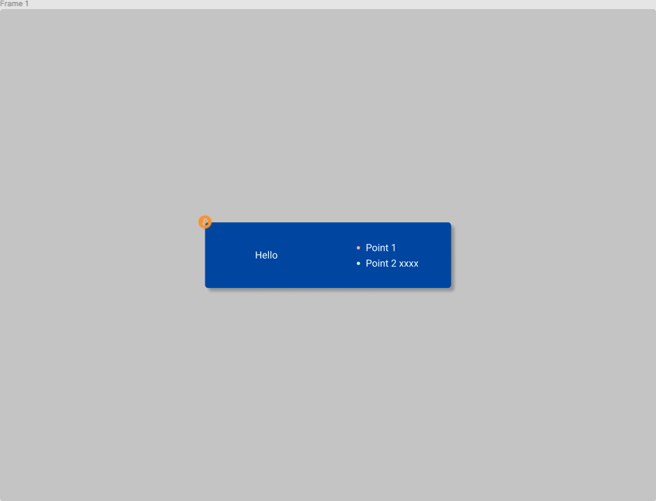

# Crypto-Arsenal Front-end Intern Test

感謝您應徵敝公司的實習前端工程師職缺，此儲存庫作為線上測試題目使用，請參考以下流程。過程中可能需時數分鐘，請同時檢閱下方的需求說明。

1. 將此儲存庫 Clone 到自己的開發環境
2. 到 https://github.com/new/ ，建立新的儲存庫
   - 請設定為 Private
   - 請將 alanwu4321、twzjwang 設定為協作者
3. 開始開發
4. 兩小時內將進度上傳到 GitHub，並將 Repo 網址寄送到以下信箱，你可以在信件內補充任何說明
   - alan@crypto-arsenal.io
   - richard@crypto-arsenal.io
   - zanjun@crypto-arsenal.io
5. 時間結束後仍可繼續開發，但兩小時內必須上傳一個版本

## 注意事項

- 開發時間也在評估範圍內，時間計算為開啟題目信件時間至最後一個 Commit 的時間。請勿試圖修改 Commit 來縮短計量時長。
- 如遇到非開發問題（包括但不限於網路異常），請立即回信通報。
- 允許使用包含但不限於 Google、ChatGPT、Stake Overflow 等服務，然而面試時我們仍會期待您對於運作原理有所了解
- 允許升級外部套件，但不可新增外部套件（除非是因升級引入的必要套件）

## 開發需求

以下分為：Next.js、TailwindCSS、Storybook、Playwright 應用。Next.js 與 TailwindCSS 為必須完成需求，Storybook 與 Playwright 為可選需求。

### Next.js

建立一個頁面 `/count`，並實作以下功能：

1. 點擊 +5 後，數字會以 500 ms 的間隔逐漸增加到目標數字。
2. 增加過程中點擊 +5 會持續提高目標數字（當原數字為 0，連續點擊兩次後，將在 2.5 秒時達到 5，5 秒時達到 10）

### TailwindCSS

建立一個頁面 `/visual`，並實現以下 Figma 圖面：
https://www.figma.com/file/qiDpmzmpE0psEz7HJ12OuS/CSS-Test?node-id=0%3A1

1. 不需要灰色背景
2. 需要使藍色區塊頁面置中
3. 必須完全使用 TailwindCSS 撰寫
4. 比特幣圖標網址為 https://i.imgur.com/Uh6IvcO.png
5. 留意顏色與陰影

### Storybook

對 TailwindCSS 需求中實現的元件建立一個 Story File，並確認其在 Storybook 中可以正常顯示。

1. 目前環境設置是 `app/**/*.stories.tsx` 視為 Story File。

### Playwright

對 Next.js 需求中實現的頁面建立一個測試，內容為確保功能正確。
